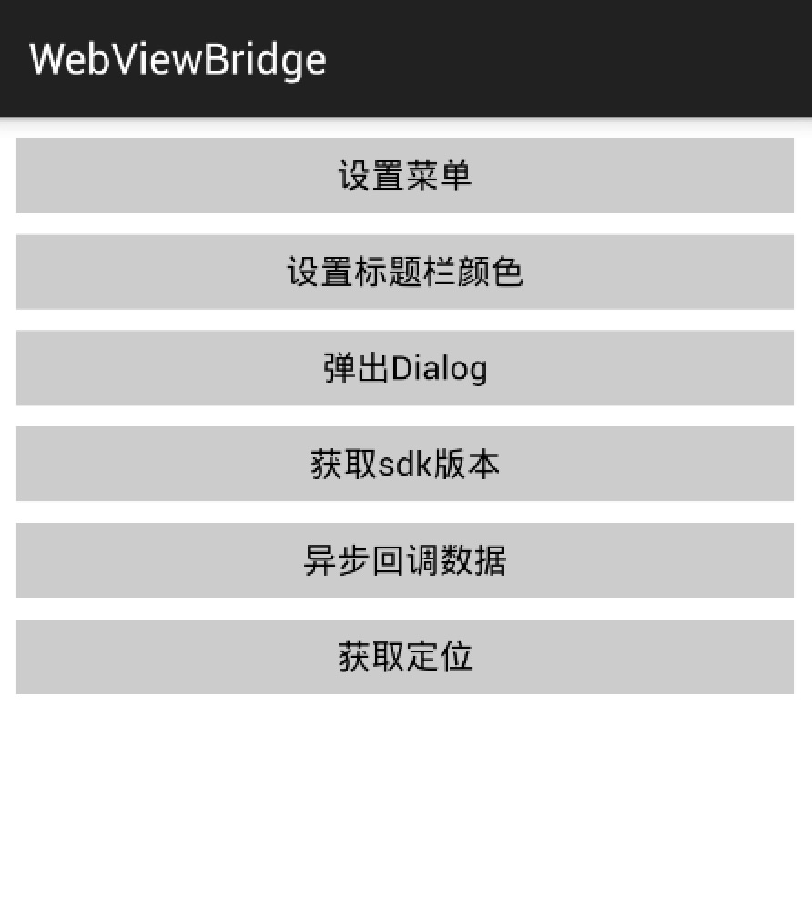
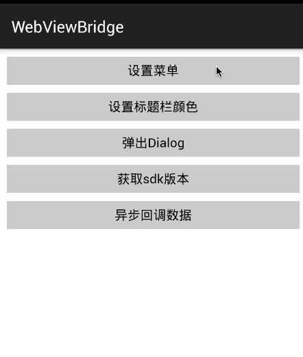

# JsBridge
android WebView和Javascript双向交互的框架,更简单的Hybrid实现方案。[ios实现方案请看这里](./doc/IOS_SOLUTION.md)

### 优势
* 接入简单、开发简单、调用简单
* 支持同步异步回调，直接注入JS对象，无需考虑平台
* 避免WebView addJavascriptInterface漏洞，兼容API 8+

更多使用方法请参考[app](./app) <br/>
<br/>

### 下面通过示例详细介绍JSBridge如何使用
<br/>
效果如上图，通过js按钮点击设置android ActionBar右上角菜单，并将点击事件传回给js处理, [demo代码](https://github.com/pengwei1024/JsBridge/tree/master/jsbridgesample)

#### 1.导入JSBridge
```
compile 'com.apkfuns.jsbridge:jsbridge:1.2.0'
```

#### 2.设置prompt监听和注入JS方法
```java
# 设置prompt监听
webView.setWebChromeClient(new WebChromeClient() {
            @Override
            public boolean onJsPrompt(WebView view, String url, String message, String defaultValue, JsPromptResult result) {
                result.confirm(JSBridge.callJsPrompt(MainActivity.this, view, message));
                return true;
            }
});

# 注入JS
webView.setWebViewClient(new WebViewClient() {
             @Override
            public void onPageFinished(WebView view, String url) {
                super.onPageFinished(view, url);
                JSBridge.injectJs(view);
            }
        });
```

#### 3.android实现注册右上角菜单
继承<b>JsModule</b>类, 所谓module，就是提供一个划分模块的功能，不同的功能放在不同的模块实现更方便的管理，当然这个模块名完全可以按自己的意愿设置，它的用途就是js的访问路径，比如我们现在module叫native，调用方法就是`JsBridge.native.set**(opt)`  我们这里实现一个NativeModule类
```java
public class NativeModule implements JsModule {
    @Override
    public String getModuleName() {
        // 这里设置模块名称
        return "native";
    }

    public static void setNavMenu(MainActivity activity, final String options, final JSCallback callback) {
        // 调用MainActivity的addMenu方法设置菜单，并将点击事件回调给JS
        activity.addMenu(options, new Runnable() {
            @Override
            public void run() {
                callback.apply(options);
            }
        });
    }
}
```
MainActivity中addMenu()实现
```java
public class MainActivity extends ActionBarActivity {
    private Menu menu;
    @Override
    public boolean onCreateOptionsMenu(Menu menu) {
        this.menu = menu;
        return true;
    }
    /**
     * 添加右上角菜单
     * @param title
     * @param r
     */
    public void addMenu(String title, final Runnable r) {
        if (menu != null) {
            menu.clear();
            MenuItem item = menu.add(Menu.NONE, 0, Menu.NONE, title).setIcon(R.mipmap.ic_launcher);
            item.setOnMenuItemClickListener(new MenuItem.OnMenuItemClickListener() {
                @Override
                public boolean onMenuItemClick(MenuItem item) {
                    r.run();
                    return true;
                }
            });
            MenuItemCompat.setShowAsAction(item, MenuItemCompat.SHOW_AS_ACTION_IF_ROOM);
        }
    }
}

```
你现在肯定充满了疑问，为什么setNavMenu的参数是这三个？Mainactivity,Sring, JsCallBack?首先MainActivity中addMenu方法没有疑问吧？就是一个通过代码设置菜单的例子，然后就是setNavMenu方法中的参数问题，先看看可选参数有那些：

参数 | 类型 | 是否可缺省  
------- | ------- | -------  
Activity | Activity 或者Activity子类 | 可缺省  
WebView | WebView或者WebView子类 | 可缺省  
String | String | 不可缺省  
JsCallback | JsCallback | 可缺省  

我们上述的例子中选择了activity，String，JsCallback，为什么是这三个参数呢，因为能操作具体UI的只有activity，设置菜单也只能在activity中，为什么可以直接写MainActivity？因为我们在onJsPrompt设置的时候就传递的就是MainActivity。第二个参数String是JS传递过来的参数，可以为空，第三个参数JsCallback是用来回调js的，我们需要将菜单点击事件还给js<br/>

再说下参数的具体规则，出了缺省外，还必须严格按照Activity、WebView、String、JsCallback的顺序排列，顺序不对不会被注入到js中。为什么呢？这是这个框架设置的规则，因为用到了反射调用方法，参数顺序不定需要处理的情况太多，而固定顺序调用参数最多只有8种：
* (String options)
* (Activity activity, String options)
* (WebView webView, String options)
* (String options, JsCallback call)
* (Activity activity, WebView view, String options)
* (Activity activity, String options, JsCallback call)
* (WebView view, String options, JsCallback call)
* (Activity activity, WebView view, String options, JsCallback call)

怎么去选择合适的参数呢，看你方法内部情况了，如果需要设置界面一般都得用activity，webView用于webView相关操作，JsCallback的话就是用于异步回调给js，这下理解了吧。

#### 4.设置协议和可调用方法
```java
JSBridge.getConfig().setProtocol("MyBridge").registerModule(NativeModule.class);
```
方法 | 值 | 描述 | 默认
------- | ------- | -------  | ------- 
setProtocol | string | 使用的协议，也是JS调用的对象名,如MyBridge.native.setNavMenu(options);|JsBridge
registerModule | JsModule | 注册js和java交互方法，如刚才写的NativeModule|无
registerMethodRun | JsMethodRun | 注册可直接运行的js脚本|默认运行JSBridgeReadyRun
setLoadReadyFuncName | string | jsBridge加载完成回调 | 'on' + Protocol + 'Ready',如window.onMyBridgeReady= function(){}

#### 5.JS调用
这样android端就完成注入了，网页端怎么访问呢？
怎么确定当前浏览器已经注入了android提供的方法而不是电脑上浏览器或者微信打开的？
```javascript
if(MyBridge) {
	//确认包含
}
```
怎么确认框架已经注入完成？
```javascript
window.onMyBridgeReady = funtion(){
	// 已经初始化完成
}
```
方法名怎么来的？默认是on + 协议名称 + Ready，所以这里是onMyBridgeReady<br/>
然后就可以调用了
```javascript
MyBridge.native.setNavMenu({
        data: '我是来自网页的按钮', onListener: function (res) {
            alert('点击按钮了，数据是:' + res)
        }
    });
```

html的完整版
```html
<!DOCTYPE html>
<html lang="en">
<head>
    <meta charset="UTF-8">
    <title>JsBridge测试Demo</title>
</head>
<body>
<button id="btn_add_menu">点击添加菜单</button>
<script type="text/javascript">
    window.onMyBridgeReady = function () {
        document.getElementById('btn_add_menu').onclick = function () {
            MyBridge.native.setNavMenu({
                data: '我是来自网页的按钮', onListener: function (res) {
                    alert('点击按钮了，按钮名称是:' + res)
                }
            });
        }
    }
</script>
</body>
</html>
```

关于js方法中的options，完整参数方法如下
```javascript
MyBridge.native.setNavMenu({
            data: '我是来自网页的按钮',
            onListener: function (res) {
                alert('点击按钮了，按钮名称是:' + res)
            },
            onSuccess: function (suc) {

            },
            onFailure: function (fai) {
                
            }
        });
```
data和onListener已经用过了，onSuccess和onFailure的值从哪里来的呢？
还记得NativeModule里面的setNavMenu方法吗？之前写的setNavMenu返回值为void，所以没有onsuccess或者onFailure，name返回值要遵循哪种规定呢，框架已经帮封装好了，直接return JsReturn.appleSuccess("success") 或者return JsReturn.appleFailure("failure")就可以接收到了。<br/>

还有有点需要注意的，如果options里面仅仅包含options.data,则不需要使用options.data，直接输入数据就好了，如下面的:
这种写法不推荐
```javascript
MyBridge.native.setNavMenu({'data':'按钮名称'});
```
可以直接写成下面的
```javascript
MyBridge.native.setNavMenu('按钮名称');
```

### 历史版本
[查看历史版本](./doc/HISTORY.md)

### 建议 & 反馈
该框架尚且存在很多不足之处，如有建议或者反馈请提[issue](https://github.com/pengwei1024/JsBridge/issues)或者邮件[pengwei1024@gmail.com](http://mail.qq.com/cgi-bin/qm_share?t=qm_mailme&email=pengwei1024@gmail.com)


### 致谢
* <a target='_blank' href='http://blog.csdn.net/sbsujjbcy/article/details/50752595'>http://blog.csdn.net/sbsujjbcy/article/details/50752595</a>

### License
<pre>
Copyright pengwei1024

Licensed under the Apache License, Version 2.0 (the "License");
you may not use this file except in compliance with the License.
You may obtain a copy of the License at

   http://www.apache.org/licenses/LICENSE-2.0

Unless required by applicable law or agreed to in writing, software
distributed under the License is distributed on an "AS IS" BASIS,
WITHOUT WARRANTIES OR CONDITIONS OF ANY KIND, either express or implied.
See the License for the specific language governing permissions and
limitations under the License.
</pre>